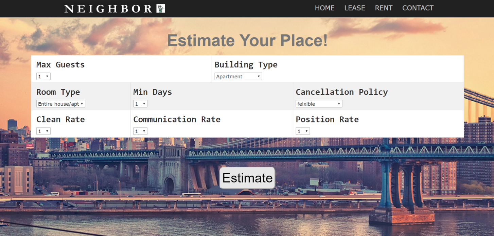
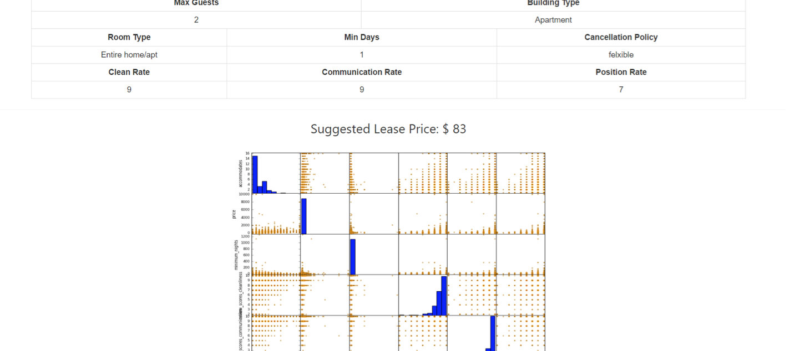
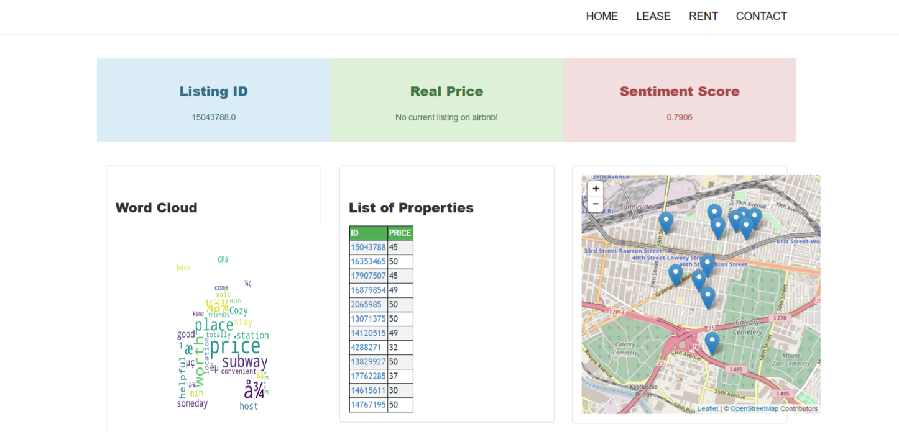

# IEOR4572-Python-Project
This is final project for Data Analysis in Operations Research class. Built a Python Flask App. 

### Project Goal
This is a website to help people to look for lease or rent in NYC. 
* If you are a landlord looking to lease, it gives you a suggested price running a multi-variate regression based on your input.
* If you are a visitor looking for a place, it shows you a list of properties that match your options by filtering data stored on MongoDB. Highest matching property comes with a word cloud based on the previous user reviews by **Natural Language Processing** and **Sentiment Analysis**. The website also gives suggested prices to visitors after taking sentiment analysis scores into account.

### Screenshots of Website

              
                 
                   

### Video link to go over the website
[HERE](https://www.youtube.com/watch?v=u0cxEK7kcGs&feature=youtu.be)
